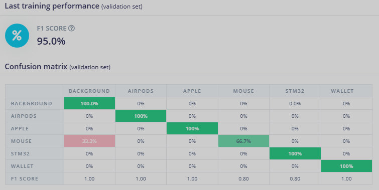
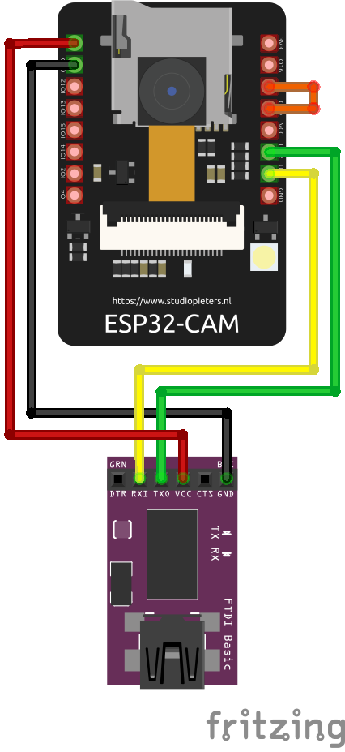

# 🧠 ESP32-CAM Object Detection with Edge Impulse

This project demonstrates real-time object detection using an **ESP32-CAM** and a model trained on **Edge Impulse: https://studio.edgeimpulse.com/public/686200/live**. The model identifies six object classes and runs directly on the ESP32-CAM using an exported Arduino library.

## 🎯 Model Overview

The model was trained on a dataset including the following classes:
- `background`
- `airpods`
- `apple`
- `mouse`
- `STM32`
- `wallet`

### 🧪 Evaluation Metrics

| Class       | Precision | Recall | F1 Score | Support |
|-------------|-----------|--------|----------|---------|
| Background  | 1.00      | 1.00   | 1.00     | 184,300 |
| Airpods     | 1.00      | 1.00   | 1.00     | 7       |
| Apple       | 1.00      | 1.00   | 1.00     | 4       |
| Mouse       | 1.00      | 0.67   | 0.80     | 3       |
| STM32       | 0.67      | 1.00   | 0.80     | 2       |
| Wallet      | 1.00      | 1.00   | 1.00     | 4       |

- **Overall F1 Score**: **95.0%**
- **Accuracy**: **99.99%**
- **Non-background F1 Score**: **95%**



---

## 🔌 Hardware Setup

### 🧰 Required Components
- ESP32-CAM board (e.g., AI-Thinker)
- FTDI programmer (5V-compatible)
- Jumper wires

### 📷 ESP32-CAM to FTDI Wiring

| FTDI Pin | ESP32-CAM Pin |
|----------|---------------|
| GND      | GND           |
| VCC (5V) | 5V            |
| TX       | U0R (RX)      |
| RX       | U0T (TX)      |
| GPIO0    | GND *(only for flashing)* |

**Note**: Connect GPIO0 to GND **only** while uploading code. Remove it after flashing to boot normally.



---

## 🚀 Deploying the Model to ESP32-CAM

### 1. Export from Edge Impulse
- Go to **Deployment** tab in Edge Impulse
- Select **Arduino Library**
- Download the `.zip` file

### 2. Install in Arduino IDE
- Open **Arduino IDE**
- Go to `Sketch > Include Library > Add .ZIP Library`
- Select your downloaded `.zip` model

### 3. Load the Example Code
- Go to `File > Examples > YourProjectName_inferencing > esp32-camera`
- Modify settings if needed (camera pinout, frame size, etc.)
- Board: `AI Thinker ESP32-CAM`
- Upload the sketch

### 4. Run and Monitor
- Disconnect GPIO0 from GND and reset the ESP32-CAM
- Open the Serial Monitor at **115200 baud** to view predictions

---

## 📦 Repository Structure

```plaintext
├── METRICS.png                   # Evaluation metric screenshot
├── ESP32-CAM-Schematics.png     # FTDI wiring diagram
├── README.md                    # Project documentation
├── esp32cam-model.ino      # ESP32-CAM inference sketch
└── edge-impulse-model.zip       # Exported Arduino library
